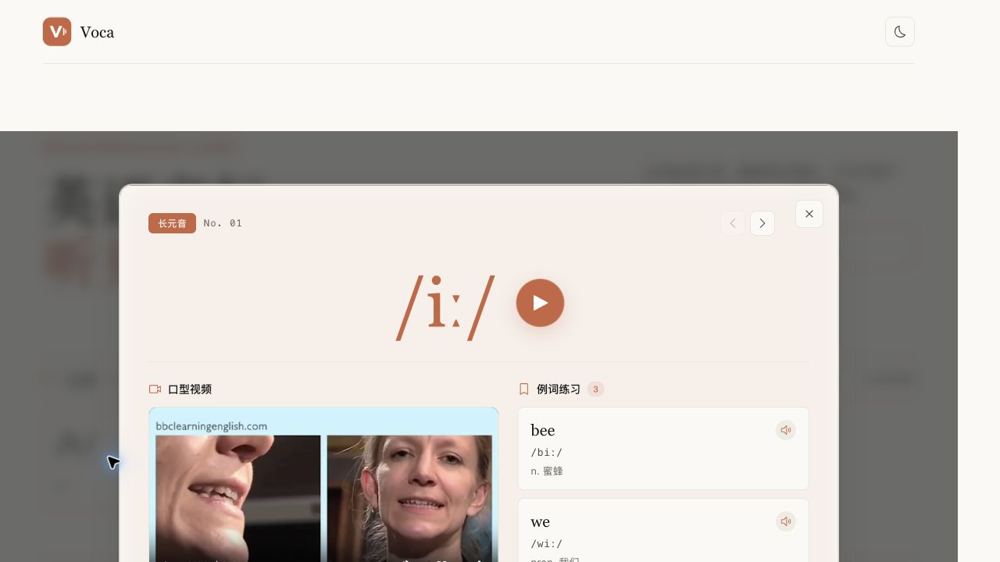
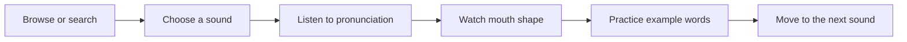

<div align="center">

# Voca

**An interactive guide to the 48 English phonetic sounds, with audio, mouth-shape video, and example words.**

[Open Voca](https://voca.yiheng.run) · [Report an issue](https://github.com/guoyiheng/voca/issues)


</div>

<p align="center">
  
</p>

## Overview

Voca turns the English phonetic chart into a tactile learning experience. Browse all 48 sounds by category, open a sound for focused practice, watch the mouth shape, listen to pronunciation, and reinforce it with real example words.

### Features

- **Complete phonetic chart** with 5 groups: long vowels, short vowels, diphthongs, unvoiced consonants, and voiced consonants.
- **Interactive sound cards** with instant playback and a shared-element style detail transition.
- **Focused detail view** with primary audio, mouth-shape video, and three example words.
- **Rich examples** including spelling, IPA transcription, translation, and word audio.
- **Instant search** across symbols, words, IPA, and translations.
- **Keyboard navigation** with `Esc` to close, arrow keys to move, and `Space` to play.
- **Light and dark themes** with a responsive layout for desktop and mobile.
- **Local media bundle** so the learning experience does not depend on third-party playback URLs.

## Practice Flow



## Quick Start

```bash
pnpm install
pnpm dev
```

The development server runs at `http://localhost:3333`.

Build and validate the project:

```bash
pnpm typecheck
pnpm lint
pnpm test
pnpm build
```

## Project Structure

```text
voca/
├── src/
│   ├── components/    # Search, cards, modal, and footer
│   ├── composables/   # Theme and phonetic data helpers
│   ├── data/          # Structured phonetic dataset
│   ├── pages/         # Main phonetic chart
│   └── styles/        # Global design tokens and themes
├── public/
│   ├── assets/        # Local audio, video, and poster media
│   └── voca-mark.svg
├── test/              # Component and behavior tests
├── uno.config.ts      # UnoCSS presets and shortcuts
└── vite.config.ts
```

## Technology Stack

| Layer | Technology |
| --- | --- |
| Interface | Vue 3, TypeScript |
| Build system | Vite, Vue Macros |
| Routing | Vue Router with file-based routes |
| Styling | UnoCSS, Carbon Icons |
| Utilities | VueUse |
| Motion | Web Animations API |
| Testing | Vitest, Vue Test Utils |

## Media Attribution

Pronunciation audio, mouth-shape videos, and example-word content were collected from [yyybabc.com](https://www.yyybabc.com) for personal learning and teaching assistance. Those third-party media assets remain subject to their original rights and are not covered by this repository's software license.

## License

The source code is licensed under the [MIT License](LICENSE).

<p align="center">© 2026 yiheng</p>
